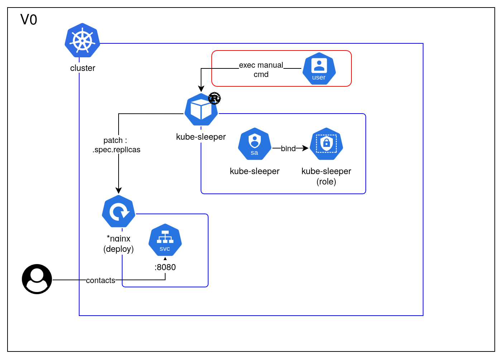
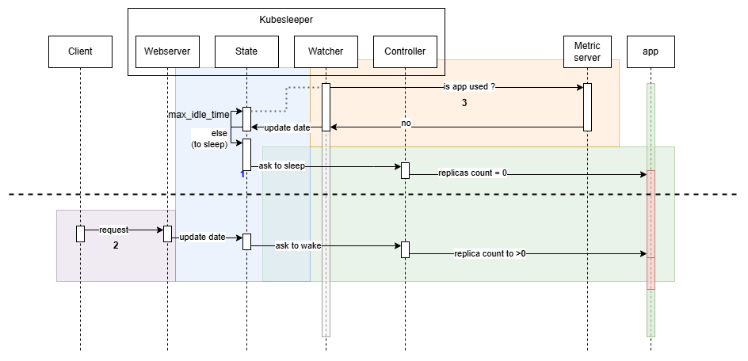
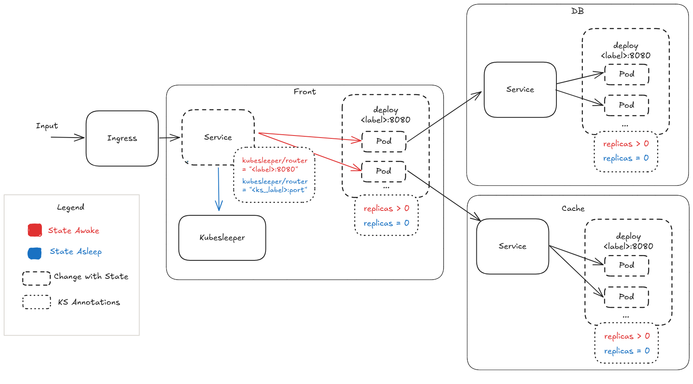

<br><br>
<div align="center">

<h1>kubesleeper</h1>
<p>A lite 'scale to zero' kubernetes manager</p>

</div>

### Project structure

```
.
├── doc/
│   └── *.md
├── target/
│   ├── user-doc/
│   └── tech-doc/
├── src/
│   └── *.rs
├── jobs/
│   └── *.yaml
├── .gitlab-ci.yml
├── Cargo.toml
└── Dockerfile
```

### nix-shell
```shell
nix-shell --pure
```

### V0 Infra



### Sequence




