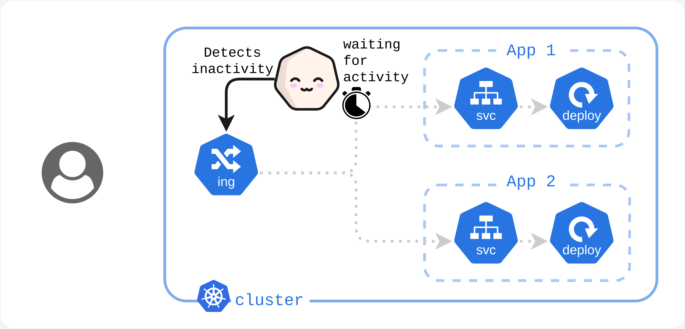
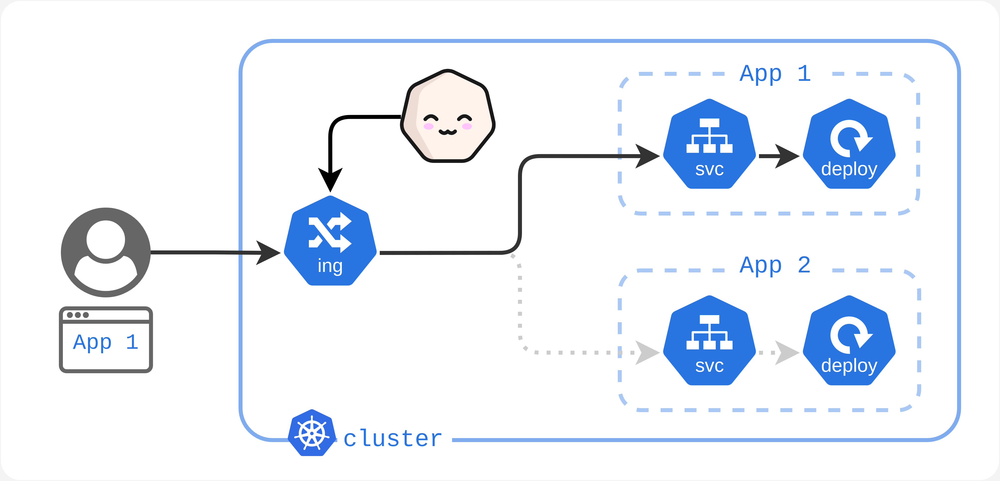

# What is kubesleeper ?

Kubesleeper is a _scale to zero_ kubernetes manager. It automatically decrease resources regarding their load, offering you less expenses.  

## Why kubesleeper

Advantage off kubesleeper :
* **Very Lightweight :** Only one very small pod to manage any cluster size 
* **No Proxy :** Use the k8s api, does not interfere with your Kubernetes resources
* **Respect Your Scaling :** Only turn _off_ or _on_ your resources and do not alter your own scaling logic. When _on_ your finer-grained scaling management rules are retained.
 
## how it works

### Step 1/5

Your cluster recives traffic, Kubesleeper detects activity.

Your cluster is in a _Awake_ state.

---

### Step 2/5

Your cluster stop recieving traffic,
Kubesleeper wait a bit to check if the lack of activity is juste temporary or if it should turn _Asleep_ your cluster.

Your cluster is in a _Spleepiness_ state.

---

### Step 3/5

Your cluster do not received any traffic since a certain time,
Kubesleeper will set your cluster _off_ meaning :

- Load resources (Deployments) are turn off (`replicas: 0`)
- Services redirects the traffic on Kublseper instead their normal Load resources 

Your cluster is in a _Asleep_ state.

---

### Step 4/5

Your cluster received traffic, but the traffic has benn redirect to Kubesleeper because their is no resources to handle it.
So Kubesleeper will turn _On_ all resources, but it can take a bit of times (talking abour secondes) for your pods to be fully operational.
So Kubesleeper will send a waiting page to he users.
Turning on the cluster means :

- Load resources (Deployments) are turn on (`replicas: {same number as when they were turned off}`)
- Services redirects the traffic to their normal load resources

Your cluster is in a _Asleep_ state.

---

### Step 5/5

Your cluster in in a normal state (like step 1)

Your cluster is in a _Awake_ state.